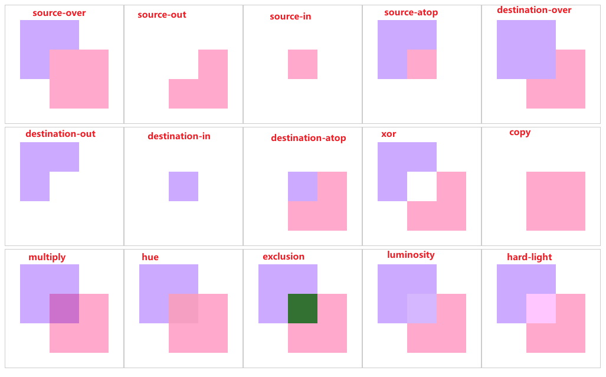

## drawImage 图像

简单绘制一张图像
```javascript
const img = new Image()
img.src = "../images/01.jpeg"
img.onload = function () {
    ctx.drawImage(img, x,y)
}
```

> drawImage(image, dx, dy, dWidth, dHeight)
```javascript
const loadImage = (src) =>
    new Promise((resolve, reject) => {
        const img = new Image()
        img.onload = () => resolve(img)
        img.onerror = reject
        img.src = src
    })

Promise.all([
    loadImage("../images/02.jpeg"),
    loadImage("../images/03.jpeg"),
]).then(([img, img2]) => {
    ctx.drawImage(img, 0, 0, 400, 220)
    ctx.drawImage(img2, 0, 320, 400, 220)
}).catch(err => console.error("图片加载失败:", err))


ctx.beginPath()
ctx.textAlign="center"
ctx.textBaseline="middle"
ctx.font="bold italic 50px serif"
ctx.strokeText('金玉风露',200,270)
```

## 精灵图动画

- drawImage(image, sx, sy, sWidth, sHeight, dx, dy, dWidth, dHeight)
- ctx.drawImage(图片源,(设置图片的显示区域),(设置图片在画布的显示区域))
- ctx.drawImage(img,(0, i * 124, img.width, 124),(j * 10, 0, img.width, 124))

```javascript
const img = new Image()
img.src = "../images/renshen.png"
img.onload = function (e) {
    let i = 0
    let j = 0
    function show() {
        ctx.clearRect(0,0,window.innerWidth,400)
        ctx.drawImage(img, 0, i * 124, img.width, 124, j * 10, 0, img.width, 124)
        ctx.strokeStyle = "#fac"
        ctx.moveTo(0,126)
        ctx.lineTo(j*10,126)
        ctx.stroke()
        i++;
        j++;
        
        if(i === 12) i = 0
    }
    setInterval(show, 100);
}
```

## video 图像

制作一个video图像

```javascript
// 创建video
const video = document.createElement('video')
video.src = '../images/火鸟.mp4'
video.autoplay = true //加载一点就播放
video.loop = true //循环播放
video.muted = true // 静音
video.play() // 播放
video.addEventListener('play',function(){
    draw()
})

ctx.arc(200,130,130,0,Math.PI * 2)
ctx.clip()
ctx.beginPath()

function draw(){
    ctx.clearRect(0,0,400,260)
    ctx.drawImage(video,0,0,400,260)
    requestAnimationFrame(draw)
}
```

## 图像下载

```javascript
let canvas1
(() => {
    const canvas = document.createElement('canvas')
    canvas1 = canvas
    canvas.width = 200
    canvas.height = 200
    const ctx = canvas.getContext('2d')
    document.body.append(canvas)

    // 绘制同心圆
    for (let index = 0; index <= 5; index++) {
        ctx.beginPath()
        ctx.arc(100, 100, index * 20, 0, Math.PI * 2)
        ctx.stroke()
    }
})();

(() => {
    const canvas = document.createElement('canvas')
    canvas.width = 400
    canvas.height = 400
    const ctx = canvas.getContext('2d')
    document.body.append(canvas)

    // 绘制图像
    ctx.drawImage(canvas1,100,100)

    // 获取按钮
    const btn = document.querySelector('button')

    btn.onclick = function(){
        const img = canvas1.toDataURL()
        
        // 创建下载链接
        const  a = document.createElement('a')
        a.href = img
        a.download = 'canvas图像'
        a.click()
    }

})();
```

## 图像像素获取与处理
> getImageData(sx, sy, sw, sh)
```javascript
 (() => {
 const canvas = document.createElement('canvas')
 canvas.width = 400
 canvas.height = 400
 const ctx = canvas.getContext('2d')
 document.body.append(canvas)

 //
 const img = new Image()
 img.src = "../images/02.jpeg"

 img.onload = function () {
     ctx.drawImage(img, 0, 0, 400, 220)
     const imageData = ctx.getImageData(0, 0, 400, 400)
     const data =imageData.data.length
     // 每个像素值为4个
     for (let i = 0; i < data; i += 4) {
         const r = imageData.data[i]
         const g = imageData.data[i + 1]
         const b = imageData.data[i + 2]
         const a = imageData.data[i + 3]

         // ... 处理需求的通道
     }
     ctx.putImageData(imageData, 0, 0)
 }
 })();
```

## 图像图案填充
> createPattern(image, repetition)
填充一个canvas图案
```javascript
let bgCanvas
(() => {
    const canvas = document.createElement('canvas')
    canvas.width = 50
    canvas.height = 50
    const ctx = canvas.getContext('2d')
    document.body.append(canvas)

    ctx.setLineDash([10, 5, 10, 5])
    ctx.moveTo(0, 25)
    ctx.lineTo(25, 0)
    ctx.lineTo(50, 25)
    ctx.lineTo(25, 50)
    ctx.closePath()
    ctx.stroke()

    ctx.beginPath()
    ctx.setLineDash([1, 2, 1, 2, 1, 2, 1])
    ctx.moveTo(23, 25)
    ctx.lineTo(27, 25)
    ctx.stroke()

    ctx.beginPath()
    ctx.setLineDash([1, 2, 1, 2, 1, 2, 1])
    ctx.moveTo(25, 23)
    ctx.lineTo(25, 27)
    ctx.stroke()

    bgCanvas = canvas
})();

(() => {
    const canvas = document.createElement('canvas')
    canvas.width = 400
    canvas.height = 400
    const ctx = canvas.getContext('2d')
    document.body.append(canvas)

    // 创建图案
    const pattern = ctx.createPattern(bgCanvas, '')

    // 图案填充
    ctx.fillStyle = pattern
    ctx.rect(100, 100, 200, 200)
    ctx.stroke()
    ctx.fill()
})();
```

填充一个图片图案
```javascript
(() => {
    const canvas = document.createElement('canvas')
    canvas.width = 400
    canvas.height = 400
    const ctx = canvas.getContext('2d')
    document.body.append(canvas)

    // 图片作为填充图案
    const img = new Image()
    img.src = "../images/04.png"

    img.onload = function () {
        // 创建图案
        const pattern = ctx.createPattern(img, 'repeat')
        
        // 图案填充
        ctx.fillStyle = pattern
        ctx.rect(0, 0, 400, 400)
        ctx.stroke()
        ctx.fill()
    }
})();
```
## 图像裁剪

> clip(fillRule) nonzero / evenodd

- nonzero 非零环绕
>顺时针经过时，数量 + 1，逆时针绘制经过裁剪，数量 - 1，区域最终经过的数量为0，就不裁剪。
- evenodd 奇偶环绕
>不分顺时针逆时针，只要经过区域数量都 + 1最终奇数裁剪，偶数不裁剪
 

```javascript
 (() => {
 const canvas = document.createElement('canvas')
 canvas.width = 400
 canvas.height = 400
 const ctx = canvas.getContext('2d')
 document.body.append(canvas)

 ctx.beginPath()
 ctx.rect(100,100,200,200)
 ctx.stroke()

 // 裁剪 
 ctx.beginPath()
 ctx.arc(200,200,100,0,Math.PI * 2)
 ctx.arc(200,200,80,0,Math.PI * 2)
 ctx.arc(200,200,60,0,Math.PI * 2)
 ctx.arc(200,200,40,0,Math.PI * 2)
 ctx.arc(200,200,20,0,Math.PI * 2)
 ctx.clip('evenodd')

 ctx.beginPath()
 ctx.fillStyle="#fac"
 ctx.rect(100,100,200,200)
 ctx.fill()
})();
```
## 图像合成 globalCompositeOperation

将上一个图像与下一个图像的合成类型
> ctx.globalCompositeOperation('source-over') //默认 source-over
```javascript
(() => {
    const canvas = document.createElement('canvas')
    canvas.width = 200
    canvas.height = 200
    const ctx = canvas.getContext('2d')
    document.body.append(canvas)

    ctx.beginPath()
    ctx.fillStyle = '#caf'
    ctx.fillRect(25, 25, 100, 100)
    
    // 图像合成
    ctx.globalCompositeOperation = "source-over"
    
    ctx.beginPath()
    ctx.fillStyle = '#fac'
    ctx.fillRect(75, 75, 100, 100)
})();
```
> 属性常用概览




## 图像合成小应用案例（刮刮乐）

```javascript
(() => {
  const canvas = document.createElement('canvas')
  canvas.width = 400
  canvas.height = 200
  const ctx = canvas.getContext('2d')
  document.body.append(canvas)


  ctx.fillStyle = "#ccc"
  ctx.fillRect(0, 0, 400, 200)

  ctx.globalCompositeOperation = "destination-out"

  ctx.beginPath()
  ctx.lineWidth = 20
  ctx.strokeStyle = '#fac'
  ctx.lineCap = "round"
  ctx.lineJoin = "round"

  let isDrawing = false

  const onMouseDown = (e) => {
      isDrawing = true
      ctx.beginPath()              // 开启新路径，避免和上一次连起来
      ctx.moveTo(e.offsetX, e.offsetY)
      // 只在这里绑定 move/up，避免重复绑定
      canvas.addEventListener('mousemove', onMouseMove)
      window.addEventListener('mouseup', onMouseUp)   // 用 window 防止鼠标移出 canvas 后松开失效
  }

  const onMouseMove = (e) => {
      if (!isDrawing) return
      ctx.lineTo(e.offsetX, e.offsetY)
      ctx.stroke()
  }

  const onMouseUp = () => {
      isDrawing = false
      cleanup()
  }

  const cleanup = () => {
      canvas.removeEventListener('mousemove', onMouseMove)
      window.removeEventListener('mouseup', onMouseUp)
  }

  // 绑定入口
  canvas.addEventListener('mousedown', onMouseDown)

})();
```