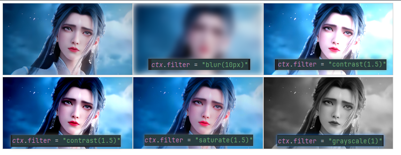
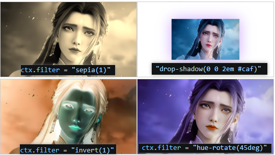

## 模糊滤镜
值越大越模糊 px
```javascript
ctx.filter = "blur(10px)"
```

## 高亮滤镜
值越小越暗，值越高越亮 %
```javascript
ctx.filter = "brightness(1.5)"
```

## 对比度
值越小接近原色，值越大越鲜明 %
```javascript
ctx.filter = "contrast(1.5)"
```

## 饱和度
值越小接近原色，值越大越鲜明 %
```javascript
ctx.filter = "saturate(1.5)"
```

## 灰度
0原色 1灰度
```javascript
ctx.filter = "grayscale(1)"
```


## 深褐色
```javascript
ctx.filter = "sepia(1)"
```
## 阴影
```javascript
 ctx.filter = "drop-shadow(0 0 2em #caf)"
```

## 反转绘图
```javascript
ctx.filter = "invert(1)"
```
## 色相旋转
```javascript
ctx.filter = "hue-rotate(45deg)"
```
