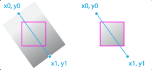
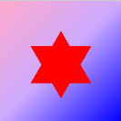
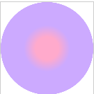
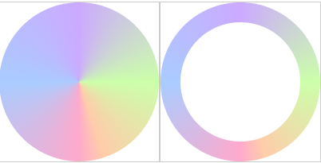
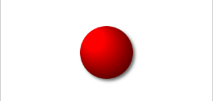

# 渐变

## 颜色渐变
> createLinearGradient(x0, y0, x1, y1)



```javascript
(() => {
 const canvas = document.createElement('canvas')
 canvas.width = 400
 canvas.height = 400
 const ctx = canvas.getContext('2d')
 document.body.append(canvas)

 // 创建渐变
 const gradient = ctx.createLinearGradient(0, 0, 400, 400)

 // 添加渐变颜色
 gradient.addColorStop(0, '#fac')
 gradient.addColorStop(0.5, '#caf')
 gradient.addColorStop(1, '#00f')
 ctx.fillStyle = gradient

 // 需要渐变的区域
 ctx.beginPath()
 ctx.rect(0, 0, 400, 400)
 ctx.fill()

 ctx.beginPath()
 ctx.fillStyle = "red"
 ctx.moveTo(100, 150)
 ctx.lineTo(300, 150)
 ctx.lineTo(200, 325)
 ctx.closePath()
 ctx.fill()

 ctx.beginPath()
 ctx.fillStyle = "red"
 ctx.moveTo(100, 275)
 ctx.lineTo(200, 100)
 ctx.lineTo(300, 275)
 ctx.closePath()
 ctx.fill()
})();
```
---


## 径向渐变
>createRadialGradient(x0, y0, r0, x1, y1, r1)

注：两个圆的关系一定是包含关系，大圆包含小圆。

```javascript
(() => {
    const canvas = document.createElement('canvas')
    canvas.width = 400
    canvas.height = 400
    const ctx = canvas.getContext('2d')
    document.body.append(canvas)

    // 创建径线渐变
    const radialGradient = ctx.createRadialGradient(200,200,100,200,200,50)
    radialGradient.addColorStop(0,'#caf')
    radialGradient.addColorStop(1,'#fac')

    ctx.fillStyle = radialGradient
    ctx.arc(200,200,200,0,Math.PI * 2)
    ctx.fill()
})();
```


## 锥形渐变

>createConicGradient(startAngle, x, y)

```javascript
(() => {
    const canvas = document.createElement('canvas')
    canvas.width = 400
    canvas.height = 400
    const ctx = canvas.getContext('2d')
    document.body.append(canvas)
    
    // 创建锥形渐变
    const gradient = ctx.createConicGradient(Math.PI / 2,200,200)
    gradient.addColorStop(0,'#fac')
    gradient.addColorStop(0.25,'#acf')
    gradient.addColorStop(0.5,'#caf')
    gradient.addColorStop(0.75,'#cfa')
    gradient.addColorStop(0.95,'#fca')
    gradient.addColorStop(1,'#fac')
    
    ctx.fillStyle = gradient
    ctx.arc(200,200,200,0,Math.PI * 2)
    ctx.fill()
})();
(() => {
    const canvas = document.createElement('canvas')
    canvas.width = 400
    canvas.height = 400
    const ctx = canvas.getContext('2d')
    document.body.append(canvas)
    
    // 创建锥形渐变
    const gradient = ctx.createConicGradient(Math.PI / 2,200,200)
    gradient.addColorStop(0,'#fac')
    gradient.addColorStop(0.25,'#acf')
    gradient.addColorStop(0.5,'#caf')
    gradient.addColorStop(0.75,'#cfa')
    gradient.addColorStop(0.95,'#fca')
    gradient.addColorStop(1,'#fac')
    
    ctx.fillStyle = gradient
    ctx.arc(200,200,200,0,Math.PI * 2)
    ctx.fill()
    
    ctx.beginPath()
    ctx.fillStyle = '#FFF'
    ctx.arc(200,200,150,0,Math.PI * 2)
    ctx.fill()
})();
```



## 阴影

对图形设置阴影

```javascript
 (() => {
    const canvas = document.createElement('canvas')
    canvas.width = 400
    canvas.height = 400
    const ctx = canvas.getContext('2d')
    document.body.append(canvas)
    
    const gradient = ctx.createRadialGradient(175, 175, 20, 200, 200, 80)
    gradient.addColorStop(0,"#f00")
    gradient.addColorStop(1,"#100")
    
    ctx.shadowColor = "#666"
    ctx.shadowBlur = 6
    ctx.shadowOffsetX = 4
    ctx.shadowOffsetY = 4
    
    ctx.fillStyle = gradient
    ctx.arc(200, 200, 50, 0, Math.PI * 2)
    ctx.fill()
 })();
```

