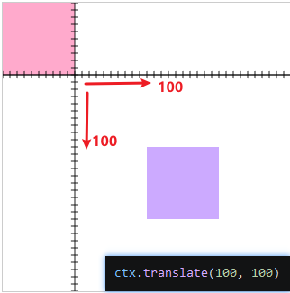
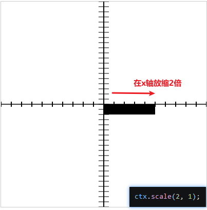
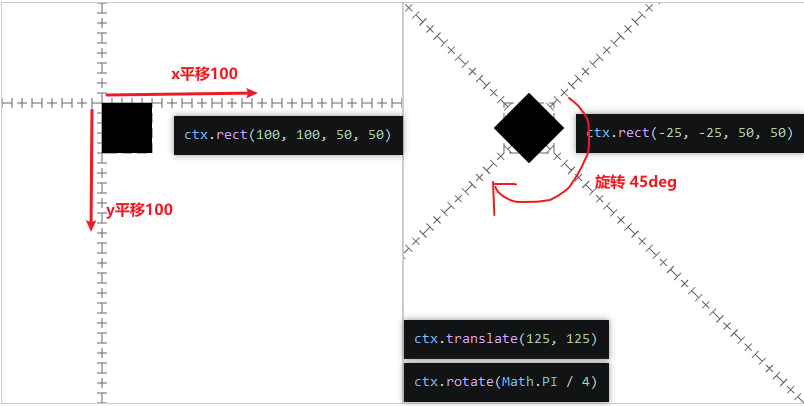
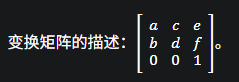
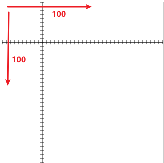
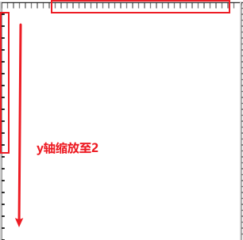
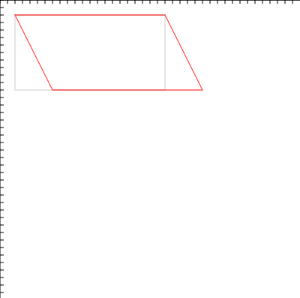
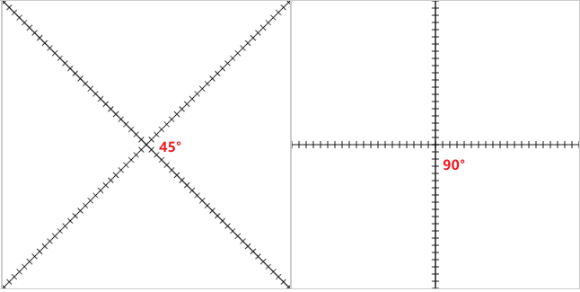

## 图像变换

- 移动的并不是图像，而是坐标系本身。
- 对于之前已经绘制的图像没有影响。

```javascript
ctx.translate(100, 100)
```



## 图像放缩
- 图像放缩是对坐标进行放缩，而不是图像本身。
```javascript
ctx.scale(2, 1);
```





## 图像旋转
- 由于旋转也是在坐标轴上进行旋转的，要想在视觉上原地旋转，需要通过变位后旋转，在调整图像的位移的位置。

```javascript
(() => {
 const canvas = document.createElement('canvas')
 canvas.width = 400
 canvas.height = 400
 const ctx = canvas.getContext('2d')
 document.body.append(canvas)
 ctx.beginPath()
 ctx.setLineDash([10,5])
 ctx.strokeStyle = "#666"
 ctx.rect(100, 100, 50, 50)
 ctx.stroke()

 ctx.translate(125, 125)
 ctx.rotate(Math.PI / 4)

 // 绘制坐标系
 ctx.beginPath()
 ctx.moveTo(-400, 0)
 ctx.lineTo(400, 0)
 ctx.stroke()

 ctx.moveTo(0, -400)
 ctx.lineTo(0, 400)
 ctx.stroke()

 for (let i = -400; i < 400; i += 10) {
     ctx.beginPath()
     ctx.moveTo(i, -5)
     ctx.lineTo(i, 5)
     ctx.stroke()

     ctx.beginPath()
     ctx.moveTo(-5, i)
     ctx.lineTo(5, i)
     ctx.stroke()
 }

 ctx.beginPath()
 ctx.rect(-25, -25, 50, 50)
 ctx.fill()

})();
```



## 图像矩阵
> ctx.transform(a,b,c,d,e,f)



x' = a·x + c·y + e

y' = b·x + d·y + f

1' = 1·0 + 1·0 + 1

---

- e 和 f 控制上下文的水平和垂直平移。
- 当 b 和 c 为 0 时，a 和 d 控制上下文的水平和垂直缩放。
- 当 a 和 d 为 1 时，b 和 c 控制上下文的水平和垂直倾斜。

---

- a, d：x、y 方向的缩放

- b, c：旋转/斜切

- e, f：平移

---

## 1_)平移矩阵
```javascript
// 以下两种都能进行x 和 y 轴移动100
ctx.transform(1, 0, 0, 1, 100, 100)
ctx.transform(0, 1, 1, 0, 100, 100)
```


## 2_)缩放矩阵
```javascript
// 在 y轴缩放至 2
ctx.transform(1, 0, 0, 2, 0, 0)
```



## 3_)倾斜矩阵
```javascript
// x轴倾斜.5,x平移20，y平移20
ctx.transform(1, 0, .5, 1, 20, 20)
```



## 4_)旋转矩阵
旋转 θ 角的公式（数学标准，逆时针为正）：

x' = x·cosθ − y·sinθ

y' = x·sinθ + y·cosθ

对应到 Canvas 矩阵：
```text
| cosθ  −sinθ  0 |
| sinθ   cosθ  0 |
|  0      0    1 |
```
所以 a = cosθ，b = sinθ，c = −sinθ，d = cosθ。

> 注意：因为 Canvas 的 y 轴朝下，正角度在视觉上是顺时针旋转。

### _常见角度

| 角度 | sin | cos | 小数 |
|------|-----|-----|------|
| 0° | 0 | 1 | 0 / 1 |
| 30° | 1/2 | √3/2 | 0.5 / 0.866 |
| **45°** | **√2/2** | **√2/2** | **0.7071 / 0.7071** |
| 60° | √3/2 | 1/2 | 0.866 / 0.5 |
| 90° | 1 | 0 | 1 / 0 |

旋转45°
```javascript
ctx.transform(0.866, 0.5, -0.5, 0.866, 0, 0)
```
等价于：
```javascript
const deg = 45
ctx.transform(Math.cos(deg * Math.PI / 180), Math.sin(deg * Math.PI / 180), -Math.sin(deg * Math.PI / 180), Math.cos(deg * Math.PI / 180), 0, 0)
```




横向距离sin()
纵向距离cos()